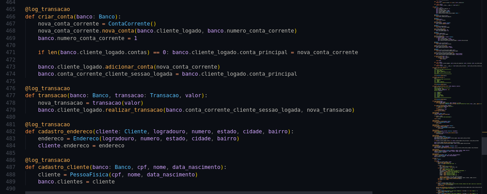

# Projeto sistema báncario
- Aplicado paradigma funcional
- Aplicado paradigma orientado a objetos
- Aplicado design pattern decorator

# O que foi feito
- Cadastro de cliente
- Cadastro de conta bancária
- Log persistente

# Otimizações
- Iterator e geradores

